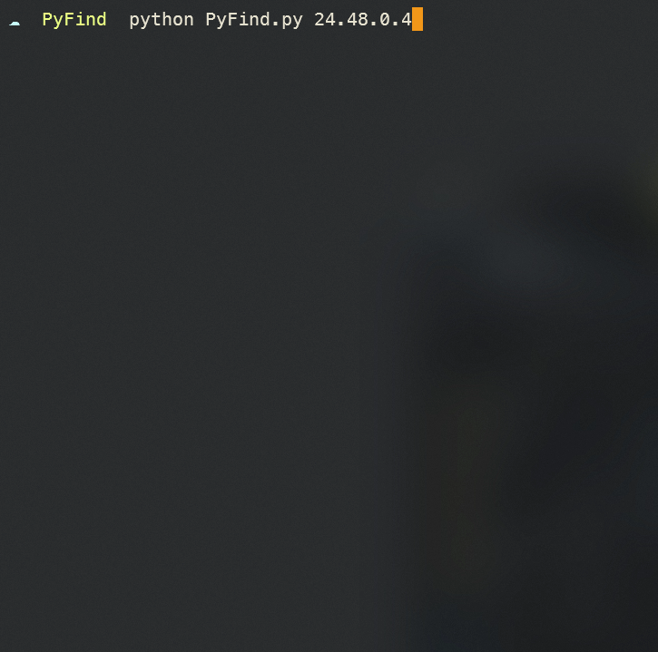

# PyFind :mag:

PyFind is a simple tool to find geolocations of IP addresses. While it's not very advanced, its something that I would like to share. PyFind works on both Windows and Linux, so you don't have to worry about that.

> :warning:***Disclaimer***:warning:: I am not responsible for any damage, exploitations, or danger you make using PyFind.

## Setup

### Prequisites

- Python interpreter
- PIP
- (Optionally) [Git](https://git-scm.com)

### Installation

1. Clone the repository using Git

   ```bash
    git clone https://github.com/AtomStriker/PyFind.git
   ```

   or download the ZIP file and extract it

2. cd to PyFind
   ```bash 
    cd <path to PyFind>
   ```

3. Download required packages using pip :package:

   ```bash
   pip install -r requirements.txt  
   ```

## Running :running:

PyFind is used through the command-line because why not.

> `cd` to PyFind if you're not already in the directory

To run the script run [PyFind.py](PyFind.py) with an optional paramter of the IP address that you want to find the geolocation of.

```bash
python PyFind.py <ip address>
```

It would usually return something like:




> *If you're having any issues/problems in PyFind, feel free to open an issue about it*

## Credits :sparkling_heart:

Huge credit to [ip-api](https://ip-api.com/) who PyFind hugely depends on because of their none-key-required API.
